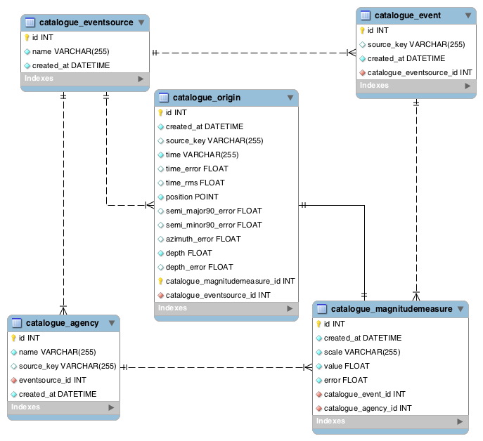

.. _modules:

High-Level API modules
==============================================================================

The High-Level API provides the tools to perform the following tasks:

1. create and access a database with the earthquake events;
2. import event data into a the database;
3. perform the homogenisation of different magnitude scale values and plot the results.
4. perform the harmonisation of measure by converting to the desired scales. 

Task 1, 2, 3, 4 are handled by :mod:`~eqcatalogue.models`,
:mod:`~eqcatalogue.importers.isf_bulletin` and
:mod:`~eqcatalogue.homogeniser`, :mod:`~eqcatalogue.harmoniser`, respectively.

Homogeniser (:mod:`eqcatalogue.homogeniser`)
------------------------------------------------------------------------------

.. automodule:: eqcatalogue.homogeniser
.. autoclass:: Homogeniser()
.. automethod:: Homogeniser.__init__([native_scale[, target_scale[, criteria[, grouper[, selector[, missing_uncertainty_strategy]]]]]])
.. automethod:: Homogeniser.set_scales

.. automethod:: Homogeniser.add_criteria
.. automethod:: Homogeniser.events
.. automethod:: Homogeniser.measures

.. automethod:: Homogeniser.set_grouper
.. automethod:: Homogeniser.grouped_measures

.. automethod:: Homogeniser.set_selector
.. automethod:: Homogeniser.set_missing_uncertainty_strategy
.. automethod:: Homogeniser.selected_native_measures
.. automethod:: Homogeniser.selected_target_measures

.. automethod:: Homogeniser.add_model
.. automethod:: Homogeniser.reset_models

.. automethod:: Homogeniser.serialize(filename)
.. automethod:: Homogeniser.plot(filename)

Harmoniser (:mod:`eqcatalogue.harmoniser`)
------------------------------------------------------------------------------

.. automodule:: eqcatalogue.harmoniser
.. autoclass:: Harmoniser()
.. automethod:: Harmoniser.__init__(target_scale)
.. automethod:: Harmoniser.add_conversion_formula
.. automethod:: Harmoniser.add_conversion_formula_from_model
.. automethod:: Harmoniser.harmonise(measures, [path_finder_cls[, measure_uncertainty[, allow_trivial_conversion]]])

Models definition (:mod:`eqcatalogue.models`)
------------------------------------------------------------------------------

.. automodule:: eqcatalogue.models

   The ER diagram of the schema of the catalogue database.

.. autoclass:: eqcatalogue.models.EventSource
.. autoclass:: eqcatalogue.models.Agency
.. autoclass:: eqcatalogue.models.Event
.. autoclass:: eqcatalogue.models.MagnitudeMeasure
.. autoclass:: eqcatalogue.models.Origin
.. autoclass:: eqcatalogue.models.MeasureMetadata
.. autoclass:: eqcatalogue.models.CatalogueDatabase
.. automethod:: eqcatalogue.models.CatalogueDatabase.recreate
.. automethod:: eqcatalogue.models.CatalogueDatabase.reset_singleton
.. automethod:: eqcatalogue.models.CatalogueDatabase.position_from_latlng
.. automethod:: eqcatalogue.models.CatalogueDatabase.get_or_create

Importer (:mod:`eqcatalogue.importers.isf_bulletin`)
------------------------------------------------------------------------------

.. automodule:: eqcatalogue.importers.isf_bulletin
.. autoclass:: eqcatalogue.importers.isf_bulletin.V1
.. automethod:: eqcatalogue.importers.isf_bulletin.V1.load
.. automethod:: eqcatalogue.importers.isf_bulletin.V1.import_events

Low-Level API modules
==============================================================================

Filtering (:mod:`eqcatalogue.filtering`)
------------------------------------------------------------------------------

.. currentmodule:: eqcatalogue
.. automodule:: eqcatalogue.filtering
.. autoclass:: Criteria
.. automethod:: Criteria.all
.. automethod:: Criteria.count
.. automethod:: Criteria.__and__
.. automethod:: Criteria.__or__
.. automethod:: Criteria.events
.. automethod:: Criteria.filter
.. automethod:: Criteria.predicate
.. automethod:: Criteria.group_measures
.. automethod:: Criteria.export
.. autoclass:: Before
.. autoclass:: After
.. autoclass:: Between
.. autoclass:: WithAgencies
.. autoclass:: WithMagnitudeScales
.. autoclass:: WithinPolygon
.. autoclass:: WithinDistanceFromPoint

CSV Serializers (:mod:`eqcatalogue.serializers.eqcsv`)
------------------------------------------------------------------------------
.. currentmodule:: eqcatalogue
.. automodule:: eqcatalogue.serializers.csv
.. autofunction:: export_measures

Grouping (:mod:`eqcatalogue.grouping`)
------------------------------------------------------------------------------

.. currentmodule:: eqcatalogue
.. automodule:: eqcatalogue.grouping
.. autoclass:: GroupMeasuresByEventSourceKey
.. automethod:: GroupMeasuresByEventSourceKey.group_measures
.. autoclass:: GroupMeasuresByHierarchicalClustering
.. automethod:: GroupMeasuresByHierarchicalClustering.group_measures
.. autoclass:: GroupMeasuresBySequentialClustering
.. automethod:: GroupMeasuresBySequentialClustering.group_measures

Regression (:mod:`eqcatalogue.regression`)
------------------------------------------------------------------------------

.. currentmodule:: eqcatalogue
.. automodule:: eqcatalogue.regression
.. autoclass:: RegressionModel
.. autoclass:: EmpiricalMagnitudeScalingRelationship
.. automethod:: EmpiricalMagnitudeScalingRelationship.make_from_measures
.. automethod:: EmpiricalMagnitudeScalingRelationship.make_from_events

Selection (:mod:`eqcatalogue.selection`)
------------------------------------------------------------------------------

.. currentmodule:: eqcatalogue
.. automodule:: eqcatalogue.selection

.. autoclass:: MissingUncertaintyStrategy
.. automethod:: MissingUncertaintyStrategy.should_be_discarded
.. automethod:: MissingUncertaintyStrategy.get_default

.. autoclass:: MUSDiscard
.. autoclass:: MUSSetEventMaximum
.. autoclass:: MUSSetDefault

.. autoclass:: MeasureSelection
.. automethod:: MeasureSelection.select

.. autoclass:: Random
.. autoclass:: Precise
.. autoclass:: AgencyRanking
